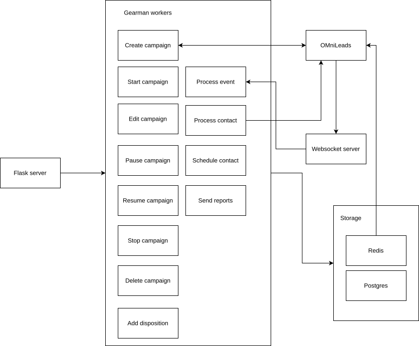

General description
===================

Omnidialer(OMD) is a dialer software meant to be a FLOSS component for Omnileads (OML) that can be used as a drop in alternative to Wombat dialer.

It is implemented in Python and use components such as Docker, docker-compose, Postgres, Redis and Gearman.

The use of Gearman allows to easily horizontal scale the system by adding Gearman workers dedicated to the most time & memory consuming resources.

The system is designed to run on every GNU/Linux system that supports bash, docker & docker-compose.

It can run in the same host OML is running or on an external host by configuring the environment variables present in the _env_ file.
The relevant environment variables are in this case: *REDIS_OML_SERVER*, *REDIS_OML_PORT*, *ASTERISK_APP*, *ASTERISK_USER*, *ASTERISK_PASS*, *ASTERISK_HOST*, *ASTERISK_PORT*, *DIALER_ACD_HOST*, *POSTGRES_OML_PASSWORD*, *POSTGRES_OML_SERVER* and *POSTGRES_OML_PORT*.

Usage:

The simplest way to use the system is to run the script start-dedicated.bash

Make sure you have Docker & Docker-Compose installed and that you have bash shell available.

Then do:

$ cp env .env

If you are in a different host of OML:

$ docker network create omnileads_omnileads

In any case do:

$ bash start-dedicated.bash

A flask server would be running at 0.0.0.0:1440 with a Gearman job server and the required Gearman workers.

After this you can hit the differents endpoints to interact with the system. Take a look at the folder 'test/curls' for a few examples.

Endpoints explanation
=====================

Create campaign
---------------

### Endpoint: `[POST] /create-campaign/<id_campaign>`

#### Description
The create-campaign endpoint creates a campaign inside OMD by importing the related data from a campaing of OML.

The value <id_campaign> correspond to the id of a campaign from OML, it will be also the id of the new campaign in OMD.

The other values imported from OML are the fields _estado_,_nombre_,_fecha_inicio_,_fecha_fin_,_control_de_duplicados_ and _prioridad_ from the table _ominicontacto_app_campana_ that will be copied to the table _campaign_. Aditionally the entries realtives to incidence rules and contacts are also imported to the tables _incidence_rules_, _incidence_rules_disposition_, contact_in_campaign & contact respectively.

The contact_strategy JSON parameter is also added as a field of the table _campaign_. This will be used in future to customize the way the dialer calls more than one time to a contact in the current campaign.

#### Method
- **HTTP Method:** `POST`

### Request Body
```json
{
  "contact-strategy": "[<id_strategy1>, <id_strategy2>, ... ,<id_strategy_n>]"
}
```


Edit campaign
---------------

### Endpoint: `[POST] /edit-campaign/<id_campaign>`

#### Description
The create-campaign endpoint edits a campaign inside OMD by modifying the related data with the current values of the campaign with the same id in OML.

The value <id_campaign> correspond to the id of a campaign in OML and OMD.

The tables _campaign_, _incidence_rules_ and _incidence_rules_disposition_ could be modified according to the existent data in OML.

#### Method
- **HTTP Method:** `POST`

### Request Body
```json
{
  "contact-strategy": "[<id_strategy1>, <id_strategy2>, ... ,<id_strategy_n>]"
}
```


Start campaign
---------------

### Endpoint: `[POST] /start-campaign/<id_campaign>`

#### Description
The start-campaign endpoint initiates the main process of the campaign, it will set the field 'dialer_status' to status ACTIVE and will start a loop that will call contacts from the OMD database according to the configuration of the campaign and the agents available in OML.

The value <id_campaign> correspond to the id of a campaign in OML and OMD.

#### Method
- **HTTP Method:** `POST`


Pause campaign
---------------

### Endpoint: `[POST] /pause-campaign/<id_campaign>`

#### Description
The pause-campaign endpoint pause the process of campaign in OMD by modifying the field _dialer_status_ of the campaign entry to the value _PAUSED_.

The value <id_campaign> correspond to the id of a campaign in OML and OMD.

#### Method
- **HTTP Method:** `POST`


Resume campaign
---------------

### Endpoint: `[POST] /resume-campaign/<id_campaign>`

#### Description
The resume-campaign endpoint resumes the process of campaign in OMD by modifying the field _dialer_status_ of the campaign entry to the value _RESUMED_ and will restart the campaign process.

The value <id_campaign> correspond to the id of a campaign in OML and OMD.

#### Method
- **HTTP Method:** `POST`

Stop campaign
---------------
### Endpoint: `[POST] /post-campaign/<id_campaign>`

#### Description
The post-campaign endpoint stops a running campaign by first set the _dialer_status_ field to status FINALIZED and after that it will copy all the entries related to the campaign to the historic tables. Entries are moved to tables _campaign_historic_, _contact_in_campaign_historic_, _incidence_rules_historic_ and _incidence_rules_disposition_historic_ . Finally the original campaign and the related tables are removed from the DB as if it were using the endpoint delete-campaign.


Delete campaign
---------------

### Endpoint: `[POST] /delete-campaign/<id_campaign>`

#### Description
The delete-campaign endpoint first pauses a campaign and then remove it completely from the DB; the tables _campaign_, _incidence_rules_, _incidence_rules_disposition_ and _contact_in_campaign_ can be affected with this endpoint.

The value <id_campaign> correspond to the id of a campaign in OML and OMD.

#### Method
- **HTTP Method:** `POST`


Add disposition for contact
---------------------------

### Endpoint: `[POST] /add-incidence-rule-disposition/<id_campaign>`

#### Description
The add-incidence-rule-disposition endpoint is meant to be used by OML to signal that a disposition option was added to a contact in the campaign and that an incidence rule should be analyzed in this case. OMD will add the information about the disposition to the contact history in the campaign and if the linked incidence rule matches it will schedule a call for the contact.

The value <id_campaign> correspond to the id of a campaign in OML and OMD.

The tables _campaign_, _incidence_rules_ and _incidence_rules_disposition_ could be modified according to the existent data in OML.

#### Method
- **HTTP Method:** `POST`

### Request Body
```json
{
        "id_contact": <id_contact>,
        "disposition_option": <id_disposition_option>
}
```


Arquitecture
============

The arquitecture of the system is shown in the following diagram:



The system serves the endpoint with a Flask server that, in turn redirects the tasks to the running Gearman workers.

There is also a websocket server that will receive the ARI events linked to the calls and will redirect the task to a Gearman worker.

The data of the system is persisted in a Postgres instance and some data are replicated on a Redis instance.

The data saved in Redis is related with contact history in a campaign and reports of the campaign.

The system also publish in PUBSUB channels information about reports and status of the campaigns.

Horizontal scalability
======================


Tests
=====

For run the unit tests just do:

$ bash rebuild-testing-truncated.bash

$ bash run-tests.bash
