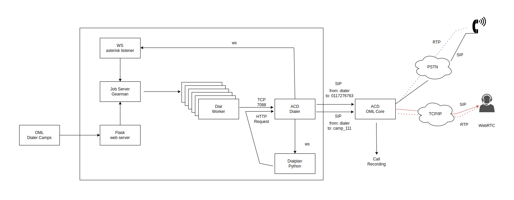
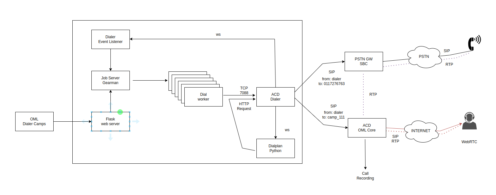

# Dialer Call Manager with RabbitMQ and PostgreSQL Logging

## Overview

This component is responsible for managing outbound calls in an Asterisk-based environment via the ARI (Asterisk Rest Interface). It listens to events from Asterisk (such as `StasisStart`, `Dial`, `ChannelHangupRequest`, `ChannelDestroyed`, etc.) and processes the information related to calls placed by a dialer. It also integrates with RabbitMQ to publish call event messages and stores call logs in PostgreSQL via a separate message-consuming component.

## Key Features

- Connects to Asterisk ARI via WebSocket and monitors call events (`StasisStart`, `StasisEnd`, `Dial`, etc.).
- Maintains a Redis counter (`dialer_pstn_calls`) to track active PSTN calls.
- Publishes call-related events (e.g. DIAL, ANSWER, BUSY, CONGESTION, NOANSWER) to RabbitMQ.
- Uses a separate consumer process that receives these messages from RabbitMQ and inserts them into a PostgreSQL reportes_app_llamadalog core omnileads-app table.
- Filters dial status events so that only specific statuses (`ANSWER`, `CANCEL`, `BUSY`, `CONGESTION`, `AMD`, `NOANSWER`) are processed and published.

## Architecture

1. **Asterisk ARI**: Provides call events via WebSocket.  
2. **Dialer Call Manager** (this component):  
   - Connects to ARI events.  
   - Extracts call data (campaign ID, customer ID, dialed number, etc.) from ARI's `app_data`.  
   - Manages a Redis counter for PSTN calls.  
   - Publishes relevant call events to RabbitMQ.
3. **RabbitMQ**: Receives call event messages from the dialer call manager.
4. **PostgreSQL Consumer**: A separate component (consumer script) consumes messages from RabbitMQ and logs them into PostgreSQL.

## Environment Variables

- `ASTERISK_USER`, `ASTERISK_PASS`: Credentials for Asterisk ARI.
- `ASTERISK_HOST`, `ASTERISK_PORT`: Host and port for connecting to the ARI.
- `ASTERISK_APP`: The ARI Stasis application name.
- `REDIS_OML_SERVER`, `REDIS_PORT`, `REDIS_DB`: Redis configuration.
- `RABBITMQ_OML_SERVER`: Host for RabbitMQ connection.
- `POSTGRES_HOST`, `POSTGRES_DB`, `POSTGRES_USER`, `POSTGRES_PASSWORD`, `POSTGRES_PORT`: For the consumer that stores call logs into PostgreSQL.
- `PSTNGW_HOSTNAME`: This environment variable activates a mode where outbound calls use a separate PSTN gateway, independent of the OmniLeads Automatic Call Distributor. This effectively removes all outbound call generation traffic from the application's ACD and directs it to the PSTN.

## Event Flow Example

1. **DIAL event**:  
   - A call attempt is made.  
   - The event arrives with `dialstatus` and `caller_name` (e.g. `9_1_123456789` → `id_camp=9`, `id_customer=1`, `tel_customer=123456789`).  
   - If `dialstatus` is `''` (attempt) or another final status (`ANSWER`, `BUSY`, etc.), a message is published to RabbitMQ if `PSTNGW_HOSTNAME` is set and data is valid.

2. **ChannelDestroyed event**:  
   - The PSTN call channel ends.  
   - Redis counter decrements.  
   - If a recognized `dialstatus` was associated, publishes a corresponding event (except for `ANSWER`) to RabbitMQ.

3. **Consumer**:  
   - Consumes messages from RabbitMQ queue.  
   - Inserts log entries into PostgreSQL.  
   - If insertion fails, message is requeued.

## Outbound dialing via a Gateway or SBC

Default Routing: Dialer calls are initially routed to the PSTN via the OmniLeads ACD.

Alternative Routing: Environment variables can be set to bypass the OmniLeads ACD and route dialer calls directly to the PSTN using a dedicated SIP trunk.

Active Configuration: The configuration activated by these variables is as follows:

## Setup Instructions

1. **Prerequisites**:
   - Asterisk with ARI enabled.
   - Redis server running.
   - RabbitMQ broker running.
   - PostgreSQL database.
   - Proper environment variables set.

2. **Run the Dialer Call Manager**:
   - Ensure environment variables are set.
   - Run the Python script that connects to ARI and listens for events.
   - The script will maintain a persistent RabbitMQ connection and publish messages as events occur.

3. **Run the PostgreSQL Consumer**:
   - Another Python script (consumer) consumes messages from RabbitMQ and inserts them into PostgreSQL.
   - Ensure environment variables for the database are correct.

## Notes

- The system expects the caller_name format: `id_camp_id_customer_tel_customer`. If this format is not respected, the event will not publish the message to RabbitMQ.
- The consumer uses a simple insert into a configured PostgreSQL table to store call logs.
- Only dial statuses `ANSWER`, `CANCEL`, `BUSY`, `CONGESTION`, `AMD`, `NOANSWER` are finally processed and published. Other statuses or intermediate states (`RINGING`) should not trigger a final message.

## Troubleshooting

- If `PSTNGW_HOSTNAME` is not set, no messages will be published to RabbitMQ.
- If RabbitMQ or PostgreSQL connections fail, the script logs errors and tries to handle these gracefully (requeue messages, etc.).
- Check Asterisk ARI logs if no events seem to be received.
- Ensure the correct ARI endpoint (`ASTERISK_HOST`, `ASTERISK_PORT`) and credentials are specified.

## License

This component is GPLv3 licensed, see `LICENSE` file for details.
